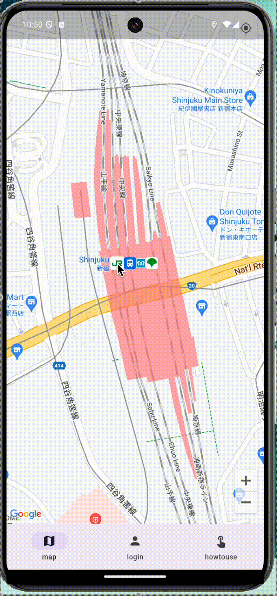

# ガチャガチャ検索アプリ

## 概要
- ガチャガチャが設置している箇所をマップにて確認・登録ができるアプリ


## 作成理由
- ミニチュア系のガチャガチャにハマり、どこにどのガチャガチャがあるのか、何台ぐらいあるのか、両替機はあるのか等を知ることができるアプリがあれば便利だと感じたため。
- 現状においても、下記のようなガチャガチャアプリはあるが、上記のような機能はなく、需要があるのではないかと感じたため。
[ガチャマニア|ガチャ専用SNS！マップから場所を探せるアプリ](https://apps.apple.com/jp/app/%E3%82%AC%E3%83%81%E3%83%A3%E3%83%9E%E3%83%8B%E3%82%A2-%E3%82%AC%E3%83%81%E3%83%A3%E5%B0%82%E7%94%A8sns-%E3%83%9E%E3%83%83%E3%83%97%E3%81%8B%E3%82%89%E5%A0%B4%E6%89%80%E3%82%92%E6%8E%A2%E3%81%9B%E3%82%8B%E3%82%A2%E3%83%97%E3%83%AA/id6446389775)

## 起動方法
```sh
# frontend/dart_definesディレクトリを作成し、dev.envを作成(中身の記述は別途共有いたします)

# コンテナ作成と起動
docker-compose up -d

# frontendディレクトリに変更し、エミュレータの立ち上げ
flutter run -d {指定のエミュレータ} --dart-define-from-file=dart_defines/dev.env

# iOSについては、以下参照のご確認をお願いいたします(Xcodeの設定)
https://zenn.dev/altiveinc/articles/separating-environments-in-flutter#xcode%E3%81%AEbuild-pre-actions-%E3%81%AB%E4%BD%9C%E6%88%90%E3%81%97%E3%81%9F%E3%82%B9%E3%82%AF%E3%83%AA%E3%83%97%E3%83%88%E3%82%92%E7%99%BB%E9%8C%B2%E3%81%99%E3%82%8B

# データベースのテーブル確認
docker exec -it shop_map_db mysql -u root -p

USE shopmap_database;

SHOW TABLES;

# users or locations
SELECT * FROM users;
```

## やりたいこと
- 会員機能(ログイン/ログアウト)でガチャ場所の基本情報登録が可能になる
  - 何系が多いか(キャラ、ミニチュア、マニアック)
  - 何台程度あるか
  - 両替機はあるか
- 自身の場所投稿の編集・削除
- 管理者機能の実装(アカウント管理、ガチャ場所管理等)

## 必要なページ
- メニュー(ボトムメニュー)
- 地図ページ
  - 地図から登録
  - 登録場所に関する口コミ投稿ページ
- アカウントページ(ログイン/新規登録)
- 管理者ページ(アカウント、登録場所管理)
- 使い方ページ

## 予定(1月末完成予定)(12/4スタート)
- バックエンド
  - 全体・バグ修正
    - [x] DockerにてMySQLのコンテナ作成
    - [x] DockerにてGolangのコンテナ作成
    - [x] GolangにてMySQLに接続し、コマンドにMySQLデータ取得
    - [x] GolangのホットリロードAirを導入
    - [x] Gormを導入し、データベース作成の記述を行い、元々ある.sqlファイルとdocker-composeファイルのバインドを削除
  - ログイン機能
    - [x] ルーティング設定
    - [x] bcryptを用い、暗号化の実装を行う
    - [x] Ginを使い、HTTPリクエストの記述を行う
    - [x] ログイン・新規登録の際のデータベース操作実装
    - [x] ログイン(ユーザー登録)機能の実装
    - [x] Redisを用い、セッションの設定
    - [x] ログアウト機能の実装
  
  - ガチャ場所の登録機能
    - router.goに登録のメソッドを設定->完了
    - 場所の登録操作を実装->完了
    - データベースを実装し、フロントから来たデータを保存->完了
  
  - MySQLに保存してあるガチャ場所をフロント側に返す
    - router.goに取得のメソッドを設定->完了
    - 場所の取得操作を実装->完了
    - フロント側にレスポンスを返す->完了

  - 投稿機能

- フロントエンド
  - 全体・バグ修正
    - [x] GoRouterを設定し、画面だけ作成(中身は何も作らない)
    - [x] Riverpodのインストールと設定
    - [x] ボトムナビゲーションを実装し、各画面に遷移
    - [x] MySQLに保存されたユーザー情報の取得
    - [x] Android/iOSエミュレータを起動できるようにする(ネイティブ対応)
    - [x] スプラッシュ画面の作成
    - [x] GitHubにてPublicにするため、Google Maps APIキーを隠蔽したい(dart-define-from-file)
    - [x] READMEにチェックボックスを付け、進捗を見やすく
    - [x] エラーや問題をなくす
    - [ ] linterをつける

  - ログインページ
    - [x] ログインフォームに入力したものをGolang側へリクエストを投げる処理実装
    - [x] 新規登録、ログイン画面からアカウントページへ飛ぶルーティング実装
    - [x] 遷移先のアカウントページの作成
    - [x] セッション処理のため、Golang側へリクエストを投げる処理実装
    - [x] ネイティブにおいてもCookieを受け取れるようにするため、Dioを導入

  - アカウントページ
    - [x] アカウント名を画面に表示させる
    - [x] セッション確認を行なった後にアカウントページを表示させ、確認が取れなかった場合はログインページにリダイレクト 
    - [ ] 自身の投稿の編集・削除をできるようにする

  - マップページ
    - [x] Google Maps API(google_maps_flutter)を使い、画面に地図表示
    - [x] 現在地を取得し、表示
    - [x] マーカーを動的に追加する(マーカーの重複判定をtoleranceで決める)
    - [x] モーダルボトムシートの実装(ピンを刺した場所を登録するフォーム作成)
    - [x] フォーム表示時、マップ操作の無効化
    - [x] モーダルボトムシートを閉じると、内容がリセット
    - [x] フォームの各入力を必須にする
    - [x] フォームの内容をバックエンド側に投げる
    - [x] フォーム入力を終えたら、フォームを閉じる
    - [x] ポーリング処理により、バックエンドから一定時間ごとにマーカーを取得
    - [x] セッション確認を行い、確認が取れる場合にのみモーダルボトムシートを表示させる実装
    - [ ] マーカー詳細のスタイル調整(一部のみ表示されてしまうため、全体表示させる)
    - [ ] 検索バー追加
    - [ ] エミュレータだとなぜか現在地を取得してくれない(実機だと現在地取得してくれるが)
    - [ ] ホットリロードを行うと、マップが表示されない
    - [ ] 位置情報許可をしなかった場合の処理を書く

  - 使い方ページ
    - [ ] 使い方を記載

## 学んだこと
- MVCモデル
  - Model:ビジネスロジックを担当する部分、DBとやりとりしたり、データの登録・更新・削除を行う
  - View:表示や入出力などのUIを担当する部分
  - Controller:ModelとViewの制御を担当する部分、Modelにデータ処理の指示を出したり、Viewに画面表示の指示を出したりする
- Dockerのボリューム
  - 外部HDDのようなイメージ
  - サービス内に作成するのと、サービス外に作成するのでは何が異なるか？->サービス内だとコンテナ(サービス)削除時にボリュームも一緒に削除されてしまう
- Gorm導入のメリット
  - MySQLコンテナ起動時に必要なデータベースやテーブルを簡単に管理できる
  - Gormを導入しないと、.shファイルにデータベースの初期設定を記述し、docker-composeのボリューム設定にてバインドしなくてはならない
- Navigatorとは
  - Flutterでは、画面遷移を管理するためにNavigatorという仕組みを使う
  - GlobalKey
    - アプリ内の特定のウィジェットを一意に識別するためのラベルのようなもの
    - 通常、FlutterのウィジェットはBuildContextを使って見つけるが、複雑な構造の中で特定のウィジェットを直接参照したい場合にGlobalKeyを使う
- GoのフレームワークGin導入のメリット
  - HTTPリクエストに対するルーティングを非常に簡単に記述できる
  - GET,POST,PUT,DELETEなどのメソッドに対応したエンドポイントをシンプルに定義でき、ミドルウェアの設定も簡単に追加できる
  - 軽量であり、高い処理速度を提供
  - ミドルウェアとは
    - Webアプリケーションのリクエストとレスポンスの間で処理を追加するための中間の処理(例：ユーザー認証、CORS対応など)
      - router.Useはミドルウェアを登録するためのメソッド
- 単にデータベース操作をするだけであれば、データベース操作の実装だけでよいが、HTTP通信を実装する理由
  - ブラウザでページを表示するため
  - 他のシステムとの連携(フロントエンドやモバイルアプリからサーバーにアクセスできる)
  - ユーザーフレンドリーな操作(ブラウザを通じたフォームやボタン操作は直感的)
- Golangのinit関数について
  - パッケージ全体の初期設定
  - 外部リソースやデータベースへの接続
  - デフォルト設定の適用
- バインドとは
  - プログラムにおいてデータを関連づけること
- 状態管理とは
  - 状態とはUIを構築するために必要なデータのこと、状態が変化するとUIが再構築される
  - 状態には2種類あり、Ephemeral state(ローカル状態)とApp state(共有状態)
    - Ephemeral stateは、画面間で共有しないなど、スコープが閉じた状態
    - App Stateは、複数の画面間で共有するなどの状態
  - StatelessWidgetは、ミュータブルな状態を持たないWidgetであり、静的な画面に使う
  - StatefulWidgetは、ミュータブルな状態を持つWidget(正確には自分自身はミュータブルな状態を持たず、Stateクラスに状態管理を委ねる、状態変化に応じてウィジェットの再ビルドを行う)
    - StatefulWidgetでは、あくまでCreateStateメソッドを作成し、その下の抽象クラスにて状態管理を行う
  - InheritedWidgetは、直近のInheritedWidgetにO(1)(ウィジェットツリー内で最も近いInheritedWidgetに即座にアクセスできる)でアクセスできる、状態の変化を下位ツリーに効率的に伝播できる
- エミュレータや実機等確認端末が変わっても共通のURIにて実装したい
  - バックエンドのホスト名を共通化
    - ローカルネットワークにホスト名を設定する(例: http://my-backend.local:8080/login)
    - サーバーをクラウド(AWS,GCP,Heroku)にデプロイし、固定ドメインを使用する
  - ローカルネットワーク内のIPアドレスを自動取得する
    - Flutterのdart:ioを使うことでネットワーク情報を取得できる
  - ngrokやCloudflare Tunnelを使用する
- セッションが必要な理由
  - ユーザーが誰なのかを特定するため->WebアプリケーションはHTTP通信を使うが、HTTPはステートレス(状態を保持しない)仕組みなため、リクエストがどのユーザーからきたかわからない
  - ログイン状態を維持するため
  - 重要なデータを安全に扱うため
- RedisとCookieについて
  - セッションにおける役割分担
    - Cookieはクライアント(ブラウザ)側に保存されるデータ
    - Redisはサーバー側でデータを一時的または永続的に保存するデータベース
  - セッション管理の仕組み
    - サーバー側でセッションIDを作成する
    - Redisにセッションデータを保存する
    - クライアントにCookieを送る
    - クライアントからCookieを受け取る
    - Redisでセッションデータを取得する
- FutureBuilderについて
  - 非同期処理(Future)の結果に基づいてウィジェットを更新するために使うFlutterのウィジェット
  - 非同期処理の進行状況や結果を監視し、その状態に応じて画面の描画を変更
  - futureは非同期処理を呼び出す場所
  - builderは非同期処理の結果を使って、どのようにUIを描画するかを決定する
    - context:現在のコンテキスト
    - snapshot:非同期処理の結果や状態を保持するウィジェット
- Future.microtask
  - 非常に短い時間で実行したい処理をイベントループの次の「空き時間」に非同期的に実行するために使われる
  - 使用用途としては、ページ推移など(イベントループの中で一番最後に行われるが、即座に実行させたい処理)
- showModalBottomSheetの中で状態変化を検知する
  - showModalBottomSheetを実行すると、元々のツリー配下ではなく、別のツリーとして構築されてしまう
  - そのため、Comsumerで定義されたProviderにアクセスできず、変更を受け取れない
- ポーリング
  - クライアント側からサーバー側に対して一定間隔でHTTPリクエストを行う方式のこと
- StreamProvider
  - maybeWhen:特定の状態での処理を定義し、それ以外ではorElseで指定したデフォルト値を返す
- CocoaPods
  - iOSおよびmacOSアプリケーションの開発におけるライブラリや依存関係を管理するためのツール
- git-filter-repo
  - Gitリポジトリの履歴を効率的に変更・フィルタリングするためのツール
    - 履歴から特定のファイルやディレクトリを削除
    - 特定のコミットを削除
- Cookieのモバイルアプリにおける扱い
  - Webブラウザは、HTTPレスポンスに含まれるSet-Cookieヘッダーを自動的に解釈し、Cookieを管理する
  - モバイルアプリではCookieの自動管理は行われず、HTTPクライアントライブラリ(dioやhttp)にてHTTPレスポンスを取得しなくてはならない
- db.Whereとdb.Findの違い
  - db.Find：条件なしで全てのレコードを取得したり、指定した条件で複数件を取得する際に使用
  - db.Where：条件を指定したクエリを構築し、1件または複数件を取得する際に使用
- printについて
  - デバッグメッセージとしてprintを使ってきたが、リリースビルドでも出力されてしまうことやログレベルによるフィルタができない
- addPostFrameCallbackについて
  - SnackBarを用いるためにScaffoldMessengerを用いるが、以下の注意を受ける
  ```
  Don't use 'BuildContext's across async gaps.
  Try rewriting the code to not use the 'BuildContext', or guard the use with a 'mounted' check.
  ```
  - 今回のようなSnackBarは画面が描画された後に再描画されるものなので、確実に実行するためにaddPostFrameCallbackを用いる

### 各ロジックの考え方メモ
- ログイン処理
  - フロントエンド
    - (login.dart)'/login'エンドポイントに対し、IDとPasswordを渡し、POSTリクエストを行う
    - (login.dart)レスポンスを受け取り、statusが正常(200)の場合は'/login/account'ページに遷移
  - バックエンド
    - (router.go)ルーターでエンドポイントを設定
    - (loginController.go)メソッドの操作(データベース操作とセッションを新規作成)
    - (user.go)引数のIDを用い、データベースから検索を行い、一致するものがあれば、パスワード照合を行う、ここまでできたらユーザー情報を返す
    - (redis.go)cookieKeyとuser_idを引数として受け取り、Redis(サーバー側)とクライアント(ブラウザ側)にセット
    - (loginController.go)フロントエンド側にuserをレスポンスとして返す
- 新規登録処理(ログイン処理と同処理部分は省略)
  - バックエンド
    - (user.go)引数のIDを用い、同一名の登録がないかデータベースで検索を行い、一致するものがなければパスワードの暗号化を行い、データベースへ登録
- セッション処理
  - フロントエンド
    - (account.dart)_checkSessionを用い、'/check-session'エンドポイントに対し、GETリクエストを行う(Dioを使うことでネイティブアプリでもCookieを送れる)
    - (account.dart)FutureBuilderを用い、非同期処理(セッション確認)の結果に基づきウィジェット更新する
    - (account.dart)レスポンスを受け取り、statusが正常(200)の場合はresponseDataを返し、ユーザー情報を画面上に表示できるようにする
  - バックエンド
    - (router.go)ルーターでエンドポイントを設定
    - (sessionController.go).envファイルから"LOGIN_USER_ID_KEY"を取得し、セッションを取得するメソッドの操作
    - (redis.go)クライアントから送られたCookie、Redisからセッションデータを取得できたら、セッションデータを返す
    - (sessionController.go)redis.goから値を受け取れた場合、フロントエンド側にsessionValueをレスポンスとして返す
- アカウントページ表示(フロントエンドのみ)
  - (account.dart)FutureBuilderを用い、非同期処理(セッション)の結果に基づいてウィジェットを更新する
  - (session.dart)snapshotの結果により、条件分岐を行う
- マップページ入力モーダルの表示有無(ログイン時のみ表示)
  - (provider.dart)checkSessionの状態によってモーダルの表示を行うため、Providerにて状態管理(ログイン状態は常時監視にしたいため、StreamProviderにしポーリング処理)
  - (map.dart)非同期処理の結果に応じて、フォームの表示有無を切り替える

## エラーや悩んだところ
- コンテナ上のgolangからコンテナ上のMySQLへ接続できない->解決済
  - docker-compose.ymlファイルにて、DBのnetworksの指定の記述が漏れていた
- 状態管理について、使い方はわかるが、どんなものかよくわかっていない->解決済
- Riverpodの各Providerがどんなときに使うものかわかっていない->おおよそ解決済
- showModalBottomSheetの中でProviderの状態変更を受け取れない->解決済
- webではなく、Android/iOSエミュレータを使うと、ログインができない->解決済
  - redis.goのGetSessionにてCookieが存在しませんとエラー
    - CORS設定と考え、router.goにCORSを記述->変わらず
    - Go(Gin)の設定で引っかかっている？(Webで確認する限り、Cookieがブラウザにセットされていない)
    - フロントのaccount.dartファイルにて確認したところ、エラーまたは未ログイン状態でログインページにリダイレクトされてしまっていると判明
    - Flutter webではうまくいっていたので、もしかしてAndroidのCookieの設定とかあるのか->モバイルアプリではCookieの自動管理は行われないので、HTTPクライアントライブラリを用いなくてはならない
    - Dioを使うことで、クライアントにCookieが渡されているところまでは確認できた
    - セッション確認APIを呼び出す関数においてもDioにて行うことでログイン処理ができるようになった
- Androidエミュレータだと、現在地を取得できない？
  - エミュレータの画面から場所を指定することはできるが、、
  [Androidエミュレータで位置情報設定術](https://note.com/danchi_kun/n/nd4203ca7e64b)
- pod installでhttpでクローンしているのに、sshでクローンしようとして、クローン元がhttpしか対応していないので、エラーになる->解決済
  ```sh
  # 以下にてgitの設定を見ると、
  git config --global --list

  url.https://.insteadof=git://
  url.https://github.com/.insteadof=git@github.com:
  # これらの記述から変換されていたと考えられる

  # また、以下の設定にも記述があった
  nano ~/.gitconfig
  ```
- CocoaPodsにて、エラー
[[!] CocoaPods did not set the base configuration of your project because your project already has a custom config set. の解決法](https://qiita.com/kokogento/items/c2979542a34610925e2d)
- iOSアプリがビルドエラーになる->解決済
  - XcodeにてBuild Pre-actionsのスクリプト登録の際、Provide build settings fromの部分を選択していなかった
```
flutter run -d 821C1104-BCAD-462D-8E43-A202EBE587B7 --dart-define-from-file=dart_defines/dev.env
Launching lib/main.dart on iPhone SE (3rd generation) in debug mode...
Running Xcode build...                                                  
Xcode build done.                                            1.2s
Failed to build iOS app
Uncategorized (Xcode): Exited with status code 127


Could not build the application for the simulator.
Error launching application on iPhone SE (3rd generation).
```
- iOSのエミュレータが立ち上がったり、立ち上がらなかったりと不安定？->解決済
[iOS Simulatorが起動しない時の対処法](https://qiita.com/yuuki-h/items/23ad407cffb548400142)
- デバッグファイルの容量が大きく、GitHubの制限容量を超えてしまう
[巨大なファイルを含んだリポジトリの履歴を改変して GitHub にインポートする方法](https://qiita.com/osakiy/items/cf59c7a535f2fb1c0f90)
```sh
# git-filter-repoを使って、buildディレクトリ以下のディレクトリのコミット履歴を削除
git filter-repo --path frontend/build/ --invert-paths

# git filter-repoは過去のコミットも変更するため、操作後はリモートリポジトリに強制的にpushする必要がある
git push origin --force --all
```

## どの技術の勉強が必要か
- データベース(MySQL)
- パスワードのハッシュ化(bcrypt)
- HTTPフレームワーク(Gin)
- ホットリロード(Air)
- セキュリティ(HTTPSを使用、.envファイルでシークレットキーやデータベース情報を管理)
- リフレッシュトークン

## 足りない知識(とりあえず思いつき次第メモ)
### Frontend
- 言語仕様、背景
- 各処理の流れ、仕組み等を1つ1つていねいに抑える
    - 非同期通信はどう行われるか
    - Widgetをどう生成しているのか
    - 状態管理がどう行われているか、各状態管理はどう使い分けるか
        - StatelessWidgetとStatefulWidgetについての理解が曖昧なままRiverpodに触れているため余計にわかっていない
- HTTP通信

### Backend
- ginのHTTP通信のやり方、使い方
- cryptoを使った暗号化
- セッションとは、Cookieとは

## 各参考サイト
### Frontend
- [【Flutter】NavigationBarを使って各画面を呼び出してみる](https://qiita.com/riku333/items/0e02e576e8dfa1878fb3) -> GoRouterを使用しているので併用不可
- [[続] go_routerでBottomNavigationBarの永続化に挑戦する(StatefulShellRoute)](https://zenn.dev/flutteruniv_dev/articles/stateful_shell_route)
- [FlutterアプリにGoogleマップを追加する](https://codelabs.developers.google.com/codelabs/google-maps-in-flutter?hl=ja#2)
- [【Flutter】Riverpodで使うProviderの種類をわかりやすくまとめてみた](https://qiita.com/yuu1111main/items/285109b3197e1499e0a0)
- [Flutter】GoogleMap for Flutter あれこれ](https://zenn.dev/slowhand/articles/f4e4e092f9b72b)
- [Flutterの状態管理の基礎](https://zenn.dev/ueshun/articles/0227f3add1b5b3)
- [【Flutter】GoogleMapの表示からgeolocatorで現在地を取得まで](https://zenn.dev/wakanao/articles/3820bcd67e4130)
- [【Flutter】checkboxの状態管理をいろんなパターンで試す](https://zenn.dev/tsukatsuka1783/articles/checkbox_handling)
- [showModalBottomSheetの中でStateNotifierProviderの変更を受け取る](https://qiita.com/jp7eph/items/d7d92b43a368ae0a2a21)
- [【Flutter】Flutterで使いたいアイコンを探す方法](https://zenn.dev/tama8021/articles/dbc931e23120bb)
- [【Flutter】環境ごとのAPIキーをiOS/Androidネイティブ側に設定する【Google Maps API】](https://zenn.dev/altiveinc/articles/flutter-set-native-api-keys-per-env)
- [【Flutter 3.19対応】Dart-define-from-fileを使って開発環境と本番環境を分ける](https://zenn.dev/altiveinc/articles/separating-environments-in-flutter)
- [FlutterアプリにGoogleマップを追加する](https://codelabs.developers.google.com/codelabs/google-maps-in-flutter?hl=ja#2)
- [【Flutter】コマンド一発でスプラッシュ画面を実装する【flutter_native_splash】](https://zenn.dev/susatthi/articles/20220406-061305-flutter-native-splash)
- [Library: スプラッシュスクリーンの実装](https://zenn.dev/web_tips/books/df8423bbb204a1/viewer/60cdda)
- [Library: アプリアイコンの設定方法](https://zenn.dev/web_tips/books/df8423bbb204a1/viewer/054dd2)
- [FlutterでHttpClientのDioを使用して認証情報などをクッキー（Cookie）に持たせる方法](https://qiita.com/koseidaiki/items/9a68b1406ee4b06b2c67)
- [【2022年】おすすめのロガーパッケージ4選【Flutter】](https://zenn.dev/susatthi/articles/20220413-153500-flutter-logger)

(読書途中)
- [「内側」から理解する Flutter 入門](https://zenn.dev/chooyan/books/934f823764db62)
- [仕組みから理解する Riverpod](https://zenn.dev/chooyan/books/92a0a489f68233)

### Backend
- [docker-composeでgolangとMySQLを繋ぐ](https://zenn.dev/ajapa/articles/443c396a2c5dd1)
- [DockerコンテナでgolangをホットリロードするAirを導入](https://zenn.dev/ajapa/articles/bc399c7e4c0def)
- [Gorm(golang用ORマッパー)を使う](https://zenn.dev/ajapa/articles/aa9b59dd30c501)
- [golangフレームワークginを使ってみる](https://zenn.dev/ajapa/articles/6471ac0c612fda)
- [golangでログイン機能を作る①(bcryptでパスワード暗号化)](https://zenn.dev/ajapa/articles/5b115f53e76f3a)
- [init関数のふしぎ #golang](https://qiita.com/tenntenn/items/7c70e3451ac783999b4f)

## 今後の展望
- 各所リファクタリング->何かしらのアーキテクチャを意識したディレクトリ構造
- 各技術の知識を深掘り学習(とりあえず実装しましたになっている)->具体的には公式ドキュメントを読み進める等
- HTTP通信ではなく、状態を保持する通信にて実装？(WebSocket、gRPC、TCP/IP？)
  - WebSocketを使用すれば、リアルタイム更新が可能
- 直近の情報登録機能の追加
  - その場所個々の掲示板を作成し、最新の情報等を共有する

## 意識したこと
- 知識がないため、各所からコードを参考にしたが、理解を深めるため「各ロジックの考え方メモ」に記録した

## メモ
```sh
# Androidエミュレータの起動
flutter run -d emulator-5554 --dart-define-from-file=dart_defines/dev.env
```
